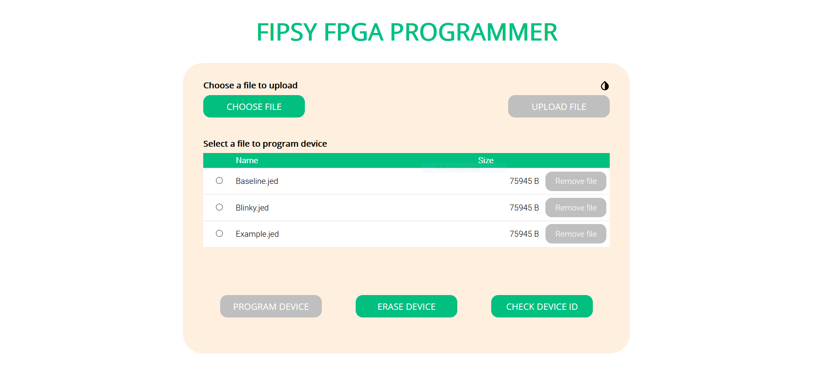

# Fipsy FPGA programmer

A tool to program the [Fipsy FPGA](https://www.mocomakers.com/fipsy-fpga/) via Wi-Fi.



## General info

This project aims to facilitate FPGA development by providing an over-the-air programming tool, allowing FPGA configurations to be tested remotely.

This repository contains source code to enable an ESP8266 microcontroller to function as a web server, listening to incoming commands from clients in the same LAN and communicating with the Fipsy FPGA via SPI.

## Features

- FPGA programming and erasing
- Bricked FPGA prevention
- Client-side JEDEC file validation
- Server-side file storage
- Support for multiple devices and browsers

## Technologies

#### Front end
- [HTML5](https://html.spec.whatwg.org/)
- [CSS3](https://www.w3.org/TR/CSS/)
- [JavaScript ES6](https://www.w3schools.com/Js/js_es6.asp)
- [AJAX](https://www.w3schools.com/xml/ajax_intro.asp)

#### Back end
- [Arduino programming language (C++)](https://www.arduino.cc/reference/en/)

## Setup

1. [Download ESP8266LittleFS](https://arduino-esp8266.readthedocs.io/en/latest/filesystem.html#uploading-files-to-file-system)
2. Embed `styles.css` and `main.js` into the `index.html` file\*
3. Upload the front end code to the file system of the ESP8266
4. Set the SSID and password of the local area networks
5. Upload the Arduino sketch to the microcontroller

<details><summary>*Alternatively, keep the files separate and add request handlers to <code>Arduino.ino</code> to serve <code>styles.css</code> and <code>main.js</code>.</summary>

#### Adding request handlers

Request handlers should be added in the `setup()` function of the Arduino sketch. They can be added using the `on()` method from the ESP8266WebServer library:

```c++
server.on("/styles.css", handleStyles);
server.on("/main.js", handleMain);
```

`/styles.css` and `/main.js` refer to the URL paths to which HTTP GET requests have to be sent. These must match the URL paths specified in the `<style>` and `<script>` tags in `index.html`.

#### Declaring the handler functions

The handler functions must be declared before the `setup()` function:

```c++
void handleStyles();
void handleMain();
```

#### Defining the handler functions

The handler functions have to serve the files to the client:

```c++
void handleStyles()
{
  digitalWrite(LED_BUILTIN, LOW);
  
  File file = LittleFS.open("/styles.css", "r");
  server.streamFile(file, "text/css");
  file.close();
  
  digitalWrite(LED_BUILTIN, HIGH);
}

void handleMain()
{
  digitalWrite(LED_BUILTIN, LOW);
  
  File file = LittleFS.open("/main.js", "r");
  server.streamFile(file, "text/javascript");
  file.close();
  
  digitalWrite(LED_BUILTIN, HIGH);
}
```

`/styles.css` and `/main.js` refer to the file paths in the server's file system.

</details>

## Usage

To use the tool, access the server\'s IP address with any modern web browser. Uploaded JEDEC files will appear in the file list, and they can be selected with a single click.

## Sources

This project was based on functionality implemented in the [Arduino-Fipsy-Programmer](https://github.com/MocoMakers/Arduino-Fipsy-Programmer) repository by MoCo Makers.

This project uses the [ESP8266WiFi](https://arduino-esp8266.readthedocs.io/en/latest/esp8266wifi/readme.html), [ESP8266WebServer](https://github.com/esp8266/Arduino/tree/master/libraries/ESP8266WebServer), [LittleFS](https://arduino-esp8266.readthedocs.io/en/latest/filesystem.html) and [SPI](https://www.arduino.cc/en/Reference/SPI) libraries.

For more information on how to program the Fipsy FPGA, please visit [MoCo Makers](https://www.mocomakers.com/basic-setup-of-the-fipsy-fpga/).